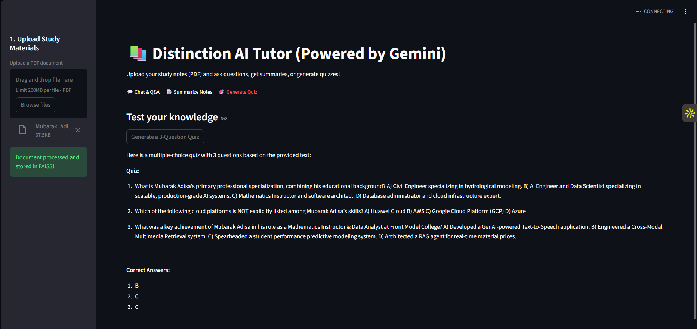

# 📚 Distinction AI Tutor (Powered by Gemini RAG)

## 📌 Project Overview
The **Distinction AI Tutor** is an intelligent, context-aware AI learning assistant designed to help students master their coursework. By leveraging **Retrieval-Augmented Generation (RAG)** and the **Google Gemini Large Language Model (LLM)**, this application allows users to upload their study materials and interact with them in real-time. 

Whether a student needs a complex topic explained, a quick summary of a chapter, or a practice quiz to test their knowledge, the AI Tutor retrieves the exact context from the uploaded documents to provide accurate, hallucination-free assistance.

## 🎯 Project Goals & Target Audience
* **Goal:** To implement a robust LLM-based Question-and-Answer (Q&A) assistant capable of advanced contextual learning support.
* **Target Audience:** Students utilizing the *Distinction* platform for studying, revision, and AI-assisted academic support.

## ✨ Core Features
1. **📄 Document Ingestion & Chunking:** Users can upload course materials (PDF format). The system automatically parses the text and splits it into manageable, overlapping chunks to preserve context.
2. **🧠 Vector Embeddings & Retrieval:** Integrates **FAISS** (Facebook AI Similarity Search) to store document embeddings locally, enabling lightning-fast semantic retrieval of relevant information.
3. **💬 Contextual Q&A Chatbot:** Users can ask subject-related questions, and the AI will answer strictly based on the provided material.
4. **📝 Automated Summarization:** Generates comprehensive, easy-to-digest summaries of lengthy study notes.
5. **🎯 Practice Quiz Generation:** Automatically creates a 3-question multiple-choice quiz (with answers) based on the uploaded notes to reinforce learning.

## 🛠️ Technology Stack
* **Language:** Python 3.x
* **Frontend/UI:** Streamlit
* **LLM Orchestration:** LangChain
* **Generative AI:** Google Gemini API (`gemini-2.5-flash` for generation, `embedding-001` for embeddings)
* **Vector Database:** FAISS (CPU)
* **Document Parsing:** PyPDF

## 🚀 Installation & Local Setup

**1. Clone the repository**
```bash
git clone [https://github.com/AdMub/FlexiSAF-Internship-Data-Science-and-Generative-AI-.git](https://github.com/AdMub/FlexiSAF-Internship-Data-Science-and-Generative-AI-.git)
cd FlexiSAF-Internship-Data-Science-and-Generative-AI-/Advanced_Phase_Deliverables/Task_1_AI_Learning_Assistant
```

**2. Install dependencies**
Ensure you have Python installed, then run:
```bash
pip install -r requirements.txt
```
**3. Configure Environment Variables**
This project requires a Google AI Studio API Key.
- Create a file named `.env` in the root directory.
- Add your API key to the file:

```Plaintext
GOOGLE_API_KEY=your_actual_api_key_here
```

**4. Run the Application**
```bash
streamlit run app.py
```

### **App Interface**


### **👨‍💻 Author**
Mubarak Abiodun Adisa
- Data Science & Generative AI Intern
- FlexiSAF Edusoft Limited