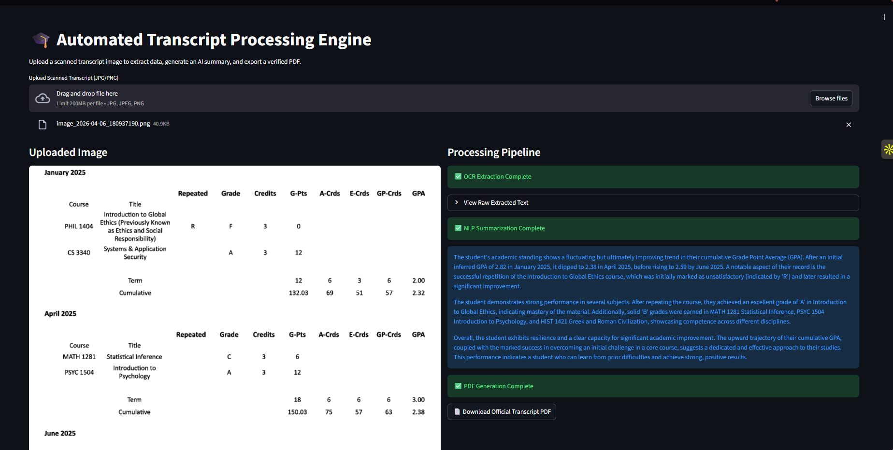

# 🎓 Automated Transcript Processing Engine (OCR + NLP)

## 📌 Project Overview
The **Automated Transcript Processing Engine** is an end-to-end AI pipeline designed to digitize, analyze, and verify academic records. By combining **Optical Character Recognition (OCR)** with **Natural Language Processing (NLP)**, this system extracts structured data from scanned transcript images, generates an intelligent academic summary, and outputs a highly professional, watermarked PDF report.

This tool is built to assist university record offices and students by automating the tedious process of manual transcript review and verification.

## 🎯 Project Goals & Target Audience
* **Goal:** To combine computer vision (OCR) and generative summarization (LLMs) to fully automate academic document processing and PDF generation.
* **Target Audience:** University administrative offices, admissions boards, and students requesting official, verifiable transcripts.

## ✨ Core Features
1. **👁️ Data Extraction (Computer Vision):** Utilizes **OpenCV** for image preprocessing (grayscale and adaptive thresholding) and **Tesseract OCR** to accurately extract raw text from scanned document images (JPG/PNG).
2. **🧠 Generative Summarization (NLP):** Integrates the **Google Gemini LLM** (`gemini-2.5-flash`) to analyze the messy extracted text, interpret academic standing, identify strong subjects, and generate a concise, professional assessment.
3. **📄 Verifiable Output Generation:** Automatically compiles the AI summary and raw data into a clean PDF document using **FPDF**, complete with an embedded "OFFICIAL TRANSCRIPT" watermark for authenticity.
4. **🖥️ Interactive UI:** Provides a seamless, user-friendly web interface powered by **Streamlit** for instant document uploading and processing.

## 🛠️ Technology Stack
* **Language:** Python 3.x
* **Frontend/UI:** Streamlit
* **Computer Vision:** OpenCV (`opencv-python-headless`), PyTesseract
* **Generative AI:** Google Gemini API (`langchain-google-genai`)
* **Document Generation:** FPDF
* **Data Handling:** Pandas, NumPy, Pillow

## 🚀 Installation & Local Setup

**1. Clone the repository**
```bash
git clone [https://github.com/AdMub/FlexiSAF-Internship-Data-Science-and-Generative-AI-.git](https://github.com/AdMub/FlexiSAF-Internship-Data-Science-and-Generative-AI-.git)
cd FlexiSAF-Internship-Data-Science-and-Generative-AI-/Advanced_Phase_Deliverables/Task_2_Transcript_Generator
```

**2. Install Tesseract OCR (System Requirement)**
- **Windows:** Download and install the Tesseract binary from UB-Mannheim. Ensure it is installed at `C:\Program Files\Tesseract-OCR`.
- **Mac/Linux:** Use Homebrew (`brew install tesseract`) or apt (`sudo apt-get install tesseract-ocr`).

**3. Install Python Dependencies**
```bash
pip install -r requirements.txt
```

**4. Configure Environment Variables**
Create a `.env` file in the root directory and add your Google AI Studio API key:

```Plaintext
GOOGLE_API_KEY=your_actual_api_key_here
```

**5. Run the Application**
```bash
streamlit run app.py
```

## **📸 Application Demo**


## **👨‍💻 Author**
**Mubarak Abiodun Adisa**
- Data Science & Generative AI Intern
- FlexiSAF Edusoft Limited