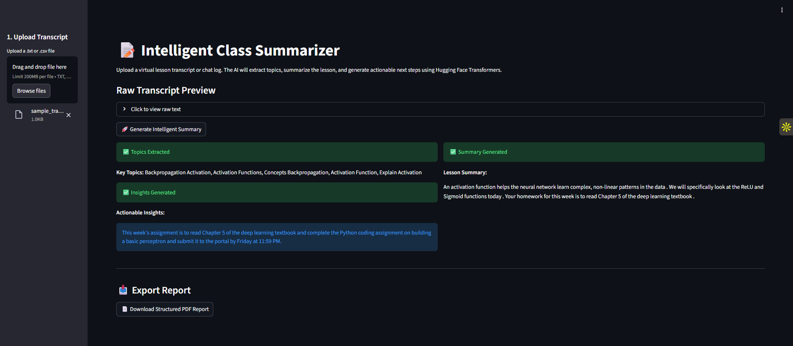

# 📝 Intelligent Class Summarizer

## 📌 Project Overview
The **Intelligent Class Summarizer** is an NLP-powered engine designed to transform raw virtual lesson transcripts and chat logs into structured, actionable study materials. Using locally deployed Hugging Face models, this tool automatically extracts core topics, generates a concise summary, and identifies key assignments and next steps.

This application provides immense value to teachers reviewing lesson effectiveness and students revising for exams.

## 🎯 Project Goals & Target Audience
* **Goal:** Apply advanced Text Summarization and Topic Modeling architectures to educational chat and lecture data.
* **Target Audience:** EdTech platforms, teachers, and students.

## ✨ Core Features
1. **📂 Multi-Format Ingestion:** Seamlessly imports and parses class discussions via `.txt` and `.csv` files using Pandas.
2. **🔑 Topic Extraction:** Utilizes **KeyBERT** to identify and extract the most mathematically relevant unigrams and bigrams from the lecture data.
3. **🧠 Transformer Summarization:** Leverages the Hugging Face `pipeline` (`distilbart-cnn`) to generate context-aware, abstractive summaries of the lesson.
4. **💡 Actionable Insights:** Uses a text-to-text generation model (`flan-t5`) to explicitly isolate assignments, homework, and "Next Steps" mentioned in the text.
5. **📄 Structured Export:** Compiles the AI outputs into a clean, downloadable PDF report using `FPDF`.

## 🛠️ Technology Stack
* **Language:** Python 3.x
* **Frontend:** Streamlit
* **Topic Modeling:** KeyBERT
* **Summarization & Inference:** Transformers (Hugging Face), PyTorch
* **Report Generation:** FPDF, Pandas

## 🚀 Installation & Local Setup

**1. Clone the repository**
```bash
git clone [https://github.com/AdMub/FlexiSAF-Internship-Data-Science-and-Generative-AI-.git](https://github.com/AdMub/FlexiSAF-Internship-Data-Science-and-Generative-AI-.git)
cd FlexiSAF-Internship-Data-Science-and-Generative-AI-/Advanced_Phase_Deliverables/Task_3_Class_Summarizer
```

**2. Install Python Dependencies**
```bash
pip install -r requirements.txt
```
(Note: This will download PyTorch and several Hugging Face models upon first execution. A stable internet connection is recommended).

**3. Run the Application**
```bash
streamlit run app.py
```

## **📸 Application Demo**


## **👨‍💻 Author**
**Mubarak Abiodun Adisa**
- Data Science & Generative AI Intern
- FlexiSAF Edusoft Limited