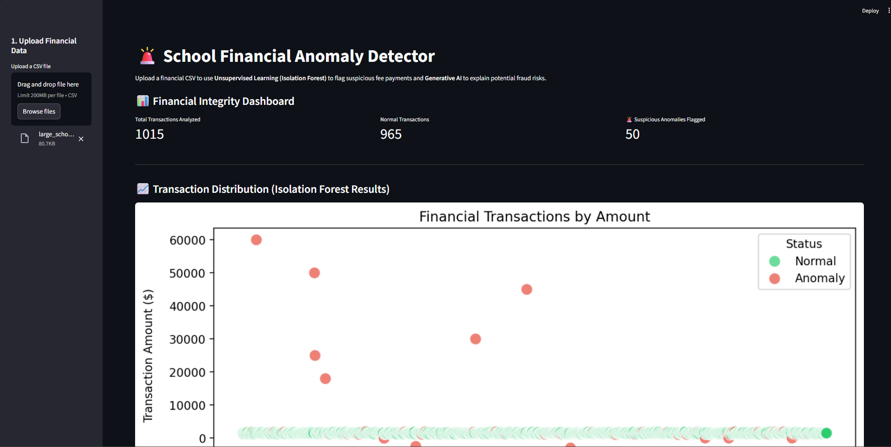
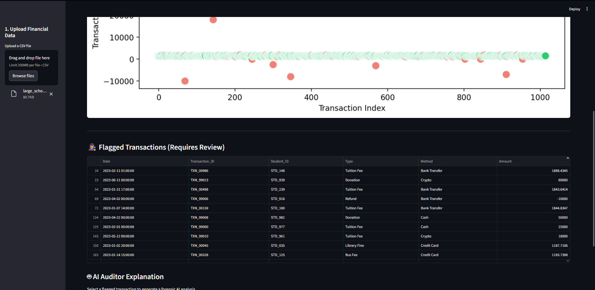

# 🚨 School Financial Anomaly Detector

## 📌 Project Overview
The **Financial Anomaly Detector** is an enterprise-level financial security tool designed to protect educational institutions from fraud, embezzlement, and systemic accounting errors. It applies **Unsupervised Machine Learning (Isolation Forest)** to automatically sift through thousands of transaction records, isolating statistically impossible or highly suspicious financial events.

Once an anomaly is flagged, the system leverages a **Generative AI LLM (Google Gemini)** acting as a virtual Forensic Auditor to provide plain-language explanations of why the transaction was flagged and recommend investigative next steps.

## 🎯 Project Goals & Target Audience
* **Goal:** Apply unsupervised learning for financial integrity and API-integrated LLMs for explainable AI.
* **Target Audience:** School finance administrators, bursars, and external financial auditors.

## ✨ Core Features
1. **📊 Automated Data Generation:** Includes a built-in synthetic data engine that generates standard tuition payments alongside hidden, highly suspicious transactions for testing.
2. **🧠 Unsupervised ML Detection:** Utilizes Scikit-Learn's `IsolationForest` to analyze continuous numerical data (transaction amounts) to detect extreme outliers without requiring labeled training data.
3. **📈 Visual Forensics:** Employs `Seaborn` and `Matplotlib` to render a clear, visual scatter plot of the financial landscape, clearly highlighting flagged anomalies in red.
4. **🤖 AI Auditor Explanations:** Integrates LangChain and the Gemini API to translate raw mathematical anomaly flags into actionable, human-readable forensic audit reports.

## 🛠️ Technology Stack
* **Language:** Python 3.x
* **Frontend:** Streamlit
* **Machine Learning:** Scikit-learn (Isolation Forest)
* **Data Processing:** Pandas, NumPy
* **Visualization:** Matplotlib, Seaborn
* **Generative AI:** Google Gemini (`gemini-2.5-flash`) via LangChain

## 🚀 Installation & Local Setup

**1. Clone the repository**
```bash
git clone [https://github.com/AdMub/FlexiSAF-Internship-Data-Science-and-Generative-AI-.git](https://github.com/AdMub/FlexiSAF-Internship-Data-Science-and-Generative-AI-.git)
cd FlexiSAF-Internship-Data-Science-and-Generative-AI-/Advanced_Phase_Deliverables/Task_4_Anomaly_Detector
```

**2. Install Python Dependencies**
```bash
pip install -r requirements.txt
```

**3. Configure Environment Variables**
Create a `.env` file in the root directory and add your Google API key:
```Plaintext
GOOGLE_API_KEY=your_actual_api_key_here
```

**4. Run the Application**
```bash
streamlit run app.py
```

## **📸 Application Demo**





## **👨‍💻 Author**
**Mubarak Abiodun Adisa**
- Data Science & Generative AI Intern
- FlexiSAF Edusoft Limited