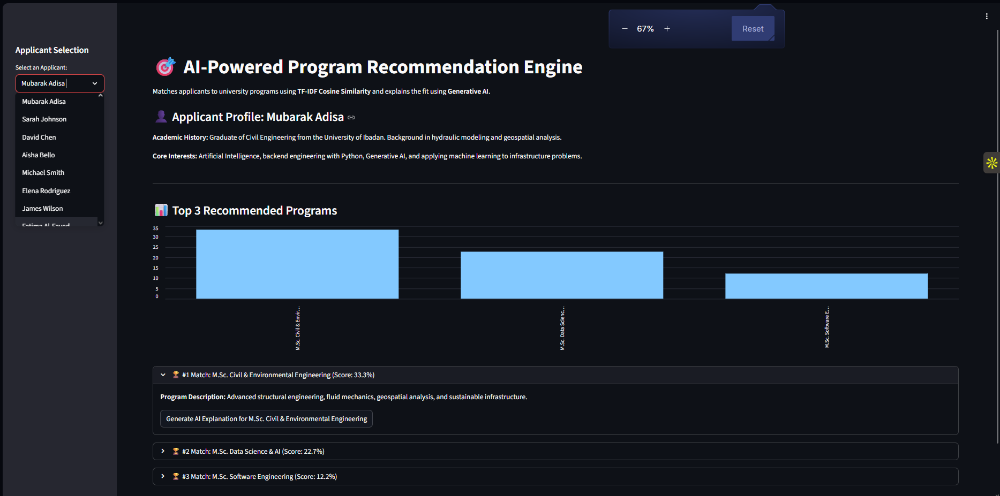

# 🎯 AI-Powered Program Recommendation Engine

## 📌 Project Overview
This application is an intelligent admissions tool designed to match university applicants to their best-fit academic programs. It leverages traditional Machine Learning (**Content-Based Filtering via TF-IDF & Cosine Similarity**) to calculate mathematical match scores, and integrates **Generative AI (Google Gemini)** to provide human-readable, narrative explanations for *why* an applicant is a good fit.

## 🎯 Project Goals & Target Audience
* **Goal:** Apply recommendation system techniques (feature similarity scoring) combined with an API-integrated LLM narrative.
* **Target Audience:** University admissions boards and applicants seeking personalized program recommendations.

## ✨ Core Features
1. **📊 Data Ingestion:** Processes applicant academic histories/interests and program descriptions via Pandas (`applicants.csv` and `programs.csv`).
2. **🧮 Feature Similarity Scoring:** Utilizes Scikit-learn's `TfidfVectorizer` to convert text profiles into numerical vectors, and computes `cosine_similarity` to rank the closest matches.
3. **📈 Confidence Visualization:** Generates visual bar charts via Streamlit to display the mathematical confidence levels of the top 3 recommendations.
4. **🧠 AI-Powered Narrative:** Integrates the Google Gemini LLM API to translate the mathematical match into a personalized, human-readable admission counselor's explanation.

## 🛠️ Technology Stack
* **Language:** Python 3.x
* **Frontend:** Streamlit
* **Machine Learning:** Scikit-learn (TF-IDF, Cosine Similarity), NumPy
* **Data Processing:** Pandas
* **Generative AI:** Google Gemini (`gemini-2.5-flash`) via LangChain

## 🚀 Installation & Local Setup

**1. Clone the repository**
```bash
git clone [https://github.com/AdMub/FlexiSAF-Internship-Data-Science-and-Generative-AI-.git](https://github.com/AdMub/FlexiSAF-Internship-Data-Science-and-Generative-AI-.git)
cd FlexiSAF-Internship-Data-Science-and-Generative-AI-/Advanced_Phase_Deliverables/Task_5_Recommendation_Engine
```

**2. Install Python Dependencies**
```bash
pip install -r requirements.txt
```

**3. Configure Environment Variables**
Create a `.env` file in the root directory and add your Google API key:
```Plaintext
GOOGLE_API_KEY=your_actual_api_key_here
```

**4. Run the Application**
```bash
streamlit run app.py
```
(Note: If `applicants.csv` and `programs.csv` are not found in the root directory, the application will automatically generate synthetic datasets to demonstrate functionality).

## **📸 Application Demo**


## **👨‍💻 Author**
**Mubarak Abiodun Adisa**
- Data Science & Generative AI Intern
- FlexiSAF Edusoft Limited