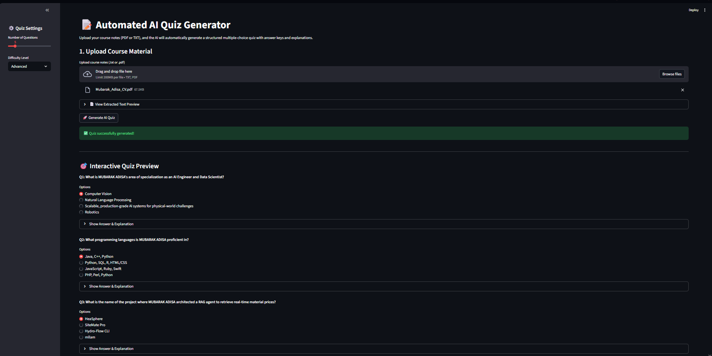
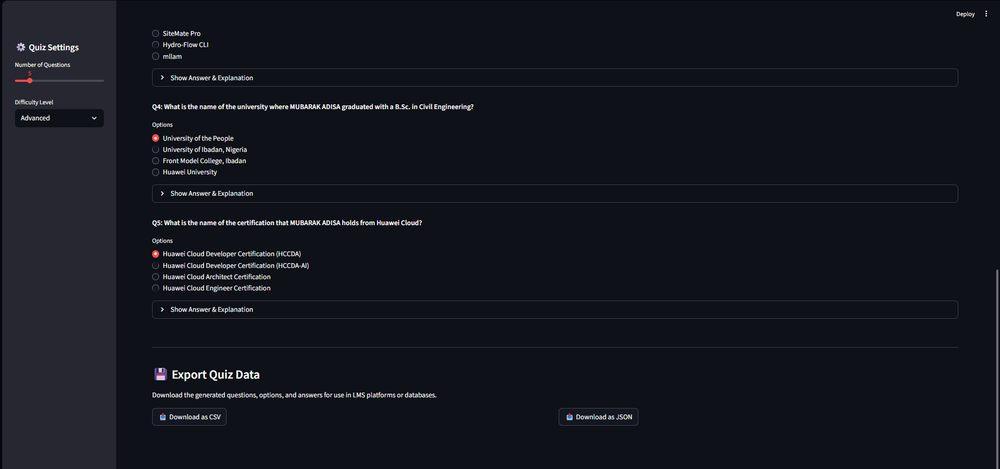

# 📝 Automated AI Quiz Generator

## 📌 Project Overview
The **Automated AI Quiz Generator** is an EdTech tool designed to drastically reduce the time educators spend creating course assessments. By uploading raw course materials (PDFs or Text notes), the system leverages advanced Large Language Models (LLMs) to intelligently chunk the content and generate highly relevant, context-aware multiple-choice quizzes. 

The application automatically produces the questions, logical distractors (options), correct answer keys, and detailed pedagogical explanations, exporting them into structured formats (CSV/JSON) for easy import into Learning Management Systems (LMS) like Distinction.app.

## 🎯 Project Goals & Target Audience
* **Goal:** Use Generative AI (LLMs) to automate and scale content creation for educational assessments.
* **Target Audience:** Educators, curriculum developers, and students on platforms like Distinction.app seeking rapid knowledge checks.

## ✨ Core Features
1. **📄 Multi-Format Ingestion:** Seamlessly extracts text from uploaded `.txt` and `.pdf` files.
2. **🎛️ Dynamic Configuration:** Allows users to specify the exact number of desired questions and the pedagogical difficulty level (Beginner, Intermediate, Advanced).
3. **🧠 Generative NLP:** Utilizes Google Gemini (`gemini-2.5-flash`) via strict prompt engineering to force structured, machine-readable JSON outputs.
4. **🖥️ Interactive UI:** Features a Streamlit-based interactive quiz preview, allowing educators to review questions, answers, and explanations before exporting.
5. **💾 Structured Export Pipeline:** Converts the AI-generated JSON payload into a Pandas DataFrame, providing instant, one-click downloads for both `CSV` and `JSON` formats.

## 🛠️ Technology Stack
* **Language:** Python 3.x
* **Frontend:** Streamlit
* **LLM Orchestration:** LangChain (`langchain-groq`)
* **Generative AI API:** Groq (`llama-3.3-70b-versatile`)
* **Data Processing:** Pandas, JSON
* **Document Parsing:** PyPDF

## 🚀 Installation & Local Setup

**1. Clone the repository**
```bash
git clone https://github.com/AdMub/FlexiSAF-Internship-Data-Science-and-Generative-AI-.git
cd FlexiSAF-Internship-Data-Science-and-Generative-AI-/Advanced_Phase_Deliverables/Task_6_Quiz_Generator
```

**2. Install Python Dependencies**
```bash
pip install -r requirements.txt
```

**3. Configure Environment Variables**
This application uses the Groq API for high-speed inference. Create a `.env` file in the root directory and add your Groq API key:
```Plaintext
GROQ_API_KEY=your_actual_groq_api_key_here
```

**4. Run the Application**
```bash
streamlit run app.py
```

## **📸 Application Demo**





## **👨‍💻 Author**
**Mubarak Abiodun Adisa**
- Data Science & Generative AI Intern
- FlexiSAF Edusoft Limited